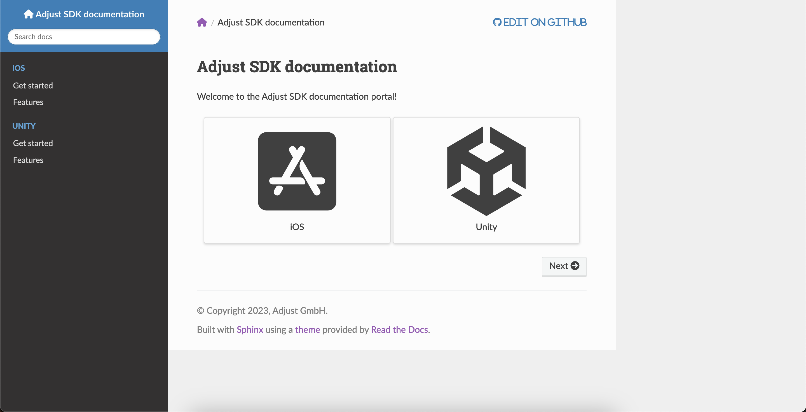

# Adjust SDK documentation

This is the repository for Adjust's SDK documentation. Written with [Sphinx](https://www.sphinx-doc.org) and [MyST](https://myst-parser.readthedocs.io).



## Live preview

This project can be run in a Docker container to enable live editing. To do this:

1. Download [Docker desktop](https://www.docker.com/products/docker-desktop/) and open it
2. Open this repository in a terminal and run the following command to build the container:

   ```console
   $ docker compose build docs
   ```

3. Once the container is built, run the following command to start the container:

   ```console
   $ docker compose up docs
   ```

4. Open http://localhost:8001 to see your the local preview

The preview updates as you save your changes.

## Check against the Microsoft style guide

This repository uses [Vale](https://vale.sh/) to test the documentation against [Microsoft's style guide](https://learn.microsoft.com/en-us/style-guide/welcome/). You can run Vale using Docker to see if anything is flagged.

1. Download [Docker desktop](https://www.docker.com/products/docker-desktop/) and open it
2. Open this repository in a terminal and run the following command to download the container:

   ```console
   $ docker compose pull vale
   ```

3. Once the container is pulled, you can run Vale against your files.

   ```console
   $ docker compose run --rm vale ios/index.md # Run against a single file
   $ docker compose run --rm vale **/**/*.md #run against all files in the repository
   ```

Vale will output any errors to your terminal window with hints on how to fix them.
