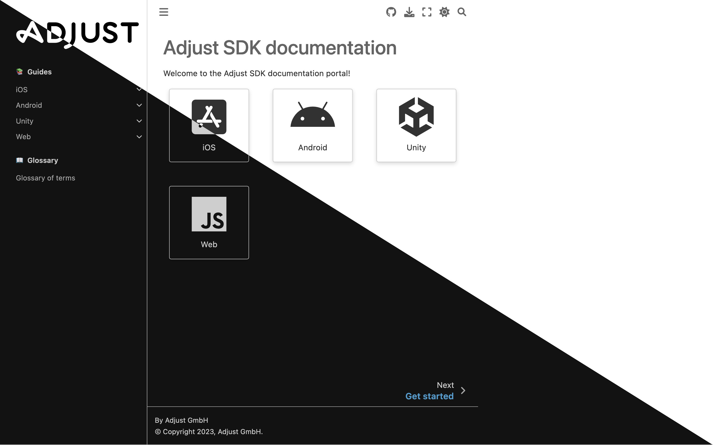

# Adjust SDK documentation

[](https://github.com/adjust/dev-docs/actions/workflows/vale.yml)
[](https://github.com/adjust/dev-docs/actions/workflows/check_links.yml)

This is the repository for Adjust's SDK documentation. Written with [Sphinx](https://www.sphinx-doc.org) and [MyST](https://myst-parser.readthedocs.io).



## Live preview

You can run a live preview of this repository to enable live editing. To do this:

1. Open this repository in a terminal and run the following command in the root directory to install [Poetry](https://python-poetry.org):

   ```console
   $ make setup
   ```

2. Run the following command in the root directory to install all dependencies:

   ```console
   $ make install
   ```

3. Once the container is built, run the following command to start the container:

   ```console
   $ make preview
   ```

4. Open http://localhost:8000 to see your the local preview

The preview updates as you save your changes. Running `make preview` removes the `_build` folder to ensure that nothing is missing. You can remove the `_build` folder at any time by running:

```console
$ make clean
```
