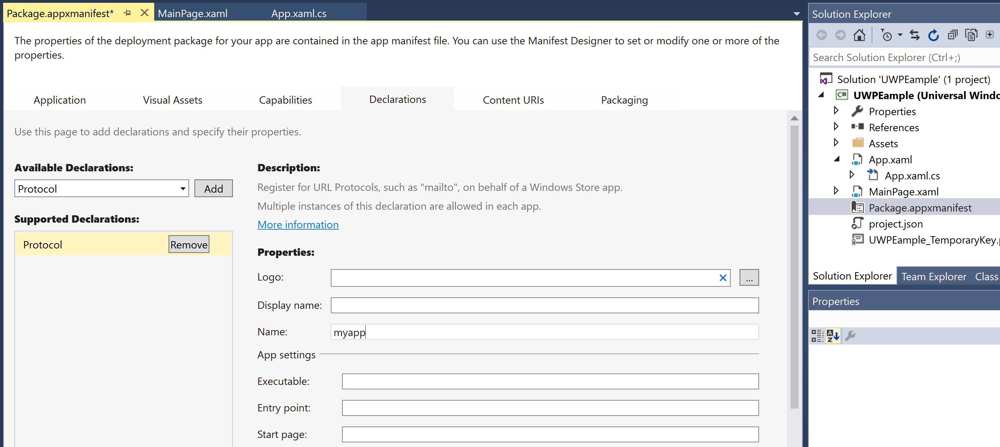

# Set up deep linking

You can create deep links to take users to specific pages in your app. The Adjust SDK uses different logic depending on if the user already has your app installed on their device:

Direct deep linking
: Occurs if the user already has your app installed. The link takes the user to the page specified in the link

Deferred deep linking
: Occurs if the user doesn't have your app installed. The link takes the user to a storefront to install your app first. After the user installs the app, it opens to the page specified in the link.

The SDK can read deep link data after a user opens your app from a link.

## Set up deep linking

If a user has your app installed, it opens when they interact with a link containing deep link information. The Adjust SDK contains tools to parse deep link information for use throughout your app. To configure deep linking in your app, you need to choose a **unique scheme name** and assign it to a specified handler method. To do this:

1. Open the {guilabel}`Solution Explorer`.
2. Double click {file}`Package.appxmanifest` to open the manifest designer.
3. Select the {guilabel}`Declarations` tab.
4. Select {menuselection}`Available Declarations --> Protocol` and select {guilabel}`Add`.
5. Choose a name for your URI scheme.

   :::{note}
   The URI scheme name must be **lowercase**
   :::

6. Press {kbd}`Ctrl+s` to save your changes.



Next, you need to set up your `OnActivated` event handler. This handles the activated deep link event. To set this up, add the following to your your {file}`App.xaml.cs` file:

```c#
// ...
protected override void OnActivated(IActivatedEventArgs args) {
   if (args.Kind == ActivationKind.Protocol) {
      var eventArgs = args as ProtocolActivatedEventArgs;
      if (eventArgs != null) {
         // to get deep link URI:
         Uri deeplink = eventArgs.Uri;
         // ...
      }
   }
   base.OnActivated(args);
}
// ...
```

:::{seealso}
Check the official [Microsoft documentation for URI activation handling](https://docs.microsoft.com/en-us/windows/uwp/launch-resume/handle-uri-activation) for more information.
:::

Your app opens when a user interacts with a link containing your **unique scheme name** in the `deep_link` parameter. This value must be URL-encoded in the URL. The Adjust SDK delivers the result as unencoded text.

## Deferred deep linking

You can configure the Adjust SDK to call a delegate function when it receives a deferred deep link. This delegate function receives the deep link as a **string** argument. Once the SDK receives the deep link content from Adjust's servers, it delivers it through this delegate function and expects a **boolean** return value. This value represents whether the SDK should launch the `OnActivated` event handler.

:::{include} /windows/reference/AdjustConfig/setup.md
:start-after: DeeplinkResponse snippet
:end-before: Snippet end
:::

## Reattribution via deep links

If you plan to run retargeting or re-engagement campaigns with deep links, you need to add a call to the `Adjust.AppWillOpenUrl` method when you receive deep link information. This prompts the SDK to check for new attribution inside the deep link. If the SDK finds new attribution information, it sends this information to Adjust's servers.

If the user needs to be reattributed due to clicking on an Adjust deep link, this triggers the [attribution callback](/windows/recording/attribution.md).

You must call `Adjust.AppWillOpenUrl` in the `OnActivated` method of your app:

```c#
using AdjustSdk;

public partial class App : Application
{
   protected override void OnActivated(IActivatedEventArgs args) {
      if (args.Kind == ActivationKind.Protocol) {
         var eventArgs = args as ProtocolActivatedEventArgs;
         if (eventArgs != null) {
            Adjust.AppWillOpenUrl(eventArgs.Uri);
         }
      }
      //...
   }
}
```

:::{seealso}
Check the [Reattribution through deep link clicks article](https://help.adjust.com/en/article/manage-reattributions#track-reattributions-via-deeplink-clicks) for more information.
:::
