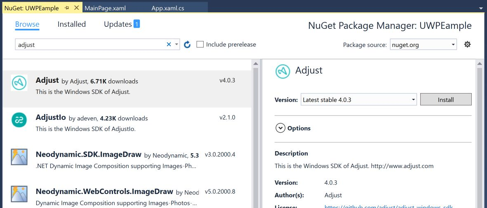
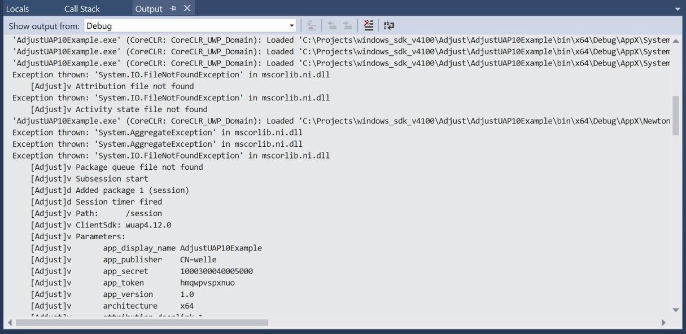

# Get started

The Adjust Windows SDK enables you to record attribution, events, and more in your Windows app. This guide shows you how to integrate the Adjust SDK with your app.

## 1. Add the SDK to your project

To use the Adjust SDK in your Windows app, you need to add it to your {program}`Visual Studio` project.

### Using NuGet

To add the SDK using NuGet:

1. Right click on the project in the {guilabel}`Solution Explorer` to open the {guilabel}`NuGet Package Manager` window.
2. Select {guilabel}`Manage NuGet Packages...`.
3. Select the {guilabel}`Browse` tab.
4. Enter `adjust` in the search box and hit {kbd}`Return` to search for the Adjust SDK.
5. The Adjust SDK should appear at the top of the list. Select it and select {guilabel}`Install` to install the package.



### Using the Package Manager Console

To install the Adjust SDK using the Package Manager Console:

1. Select {menuselection}`TOOLS --> NuGet Package Manager --> Package Manager Console` to open the Package Manager Console view.
2. Enter the following install command in the prompt and hit {kbd}`Return` to run it.

   ```powershell
   PM> Install-Package Adjust
   ```

## 2. Integrate the Adjust SDK

Once you've added the Adjust SDK to your {program}`Visual Studio` project, you need to integrate it in your app.

1. Open the Solution Explorer.
2. Open the {file}`App.xaml.cs` file.
3. Add the following directive to the top of the file: `using AdjustSdk;`

### 3. Initialize the Adjust SDK

To initialize the Adjust SDK, you need to create a config object. This object contains configuration options that control how the Adjust SDK behaves. Pass the following arguments for a minimal setup:

-  `appToken`: Your [app's token](https://help.adjust.com/en/article/app-settings#view-your-app-token).
-  `environment`: The environment you want to run the SDK in. Set this to `AdjustConfig.EnvironmentSandbox`.

To initialize the Adjust SDK with this config object:

1. Declare your config object in the `OnLaunched` method of your app.
2. Pass the config object as an argument to the `Adjust.ApplicationLaunching` method.

:::{tab-set-code}

```c#
using AdjustSdk;

sealed partial class App : Application
{
   protected override void OnLaunched(LaunchActivatedEventArgs e)
   {
      string appToken = "{YourAppToken}";
      string environment = AdjustConfig.EnvironmentSandbox;
      var config = new AdjustConfig(appToken, environment);
      Adjust.ApplicationLaunching(config);
   // ...
   }
}
```

:::

## 4. Configure the Adjust SDK

Once you've added your config object and initialization logic, you can configure the Adjust SDK to record information about different parts of your app. Check out the guides for the SDK's [configuration features](configuration/index.md) and [recording features](recording/index.md) to set up exactly what you want to record.

## 6. Build and debug your app

Once you've integrated the Adjust SDK and set it up, you can start the Visual Studio debugger to check that the SDK is logging as expected. To do this:

1. Select {menuselection}`Debug --> Start Debugging` to open the debugger.
2. Check the {guilabel}`Output` tab to see your app's logs. Adjust SDK logs are displayed with an {guilabel}`[Adjust]` tag.


